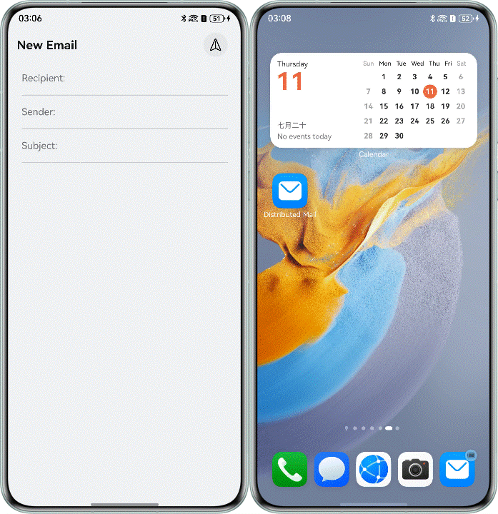

# Realization of distributed mail function based on application connection

## Overview

Based on application connection and distributed data objects, this Codelab implements distributed mail applications. It mainly includes the following functions:

1. Transfer data across devices through distributed data objects.
2. By clicking on the system Dock bar, the application can be connected and data can be transmitted.

## Preview

 

## How to Use

1. Enter the home page of the application, and you can enter the corresponding contents in the recipient, sender and subject text boxes.
2. Open the distributed mail application on the local side, and a distributed mail application icon will be added in the Dock bar of the opposite device. Click the distributed mail application, and the local application will be connected to the opposite device.

## Project Directory

```
├──entry/src/main/ets
│  ├──common
│  │  └──CommonConstants.ets           // Constant set
│  ├──entryability
│  │  └──EntryAbility.ets              // Entry file
│  ├──pages
│  │  └──MailHomePage.ets              // Mail home page
│  ├──utils
│  │  └──MailInfoManager.ets           // Mail information management class
│  └──viewmodel
│     └──MailViewModel.ets             // Mail model
└──entry/src/main/resources            // Resource file
```

## How to Implement

1. Configure the migrate tag, and configure the sustainable tag in "src/main/module.json5": true means migration is supported, false means migration is not supported, and the default value is false.
2. Call the distributedDataObject.create() interface to create a distributed data object, and fill the data to be migrated into the distributed data object data.
3. Call the distributedDataObject.genSessionid() interface to generate the networking id of the data object, and use this id to call setSessionId() to join the networking and activate the distributed data object.
4. Call the distributedDataObject.save () interface to persist the activated distributed data object.
5. Call setMissionContinueState() to set the migration status to ACTIVE and create an empty distributed data object to receive the recovered data.
6. Read the networking id of distributed data objects from want, call setSessionId() to join the networking, and activate the distributed data objects.
7. Register the on() interface to monitor data changes. When receiving the callback of the event with the status of restore, obtain the basic information of the mail saved when the A device exits through the distributed data object, and save it in AppStorage for the B device to obtain and use.
8. Manually load the page to be restored in the onWindowStageRestore() life cycle.

## Permissions

N/A.

## Constraints

1. The sample is only supported on Huawei phones with standard systems.
2. The HarmonyOS version must be HarmonyOS 5.1.1 Release or later.
3. The DevEco Studio version must be DevEco Studio 5.1.1 Release or later.
4. The HarmonyOS SDK version must be HarmonyOS 5.1.1 Release SDK or later.
5. Double-ended devices need to log in to the same Huawei account, so it is recommended to turn on the device finding function.
6. Double-ended devices need to turn on the Wi-Fi and Bluetooth switches. When conditions permit, it is recommended to connect to the same LAN.
7. Both end devices need this application.
