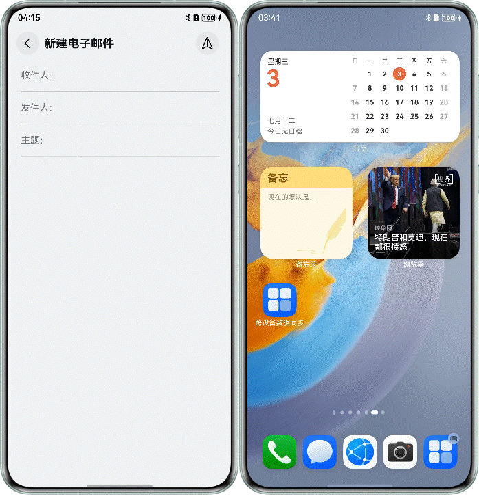

# 基于应用接续实现分布式邮件功能

## 项目简介

本篇Codelab基于应用接续、分布式数据对象，实现分布式邮件应用。主要包含以下功能：

1. 通过分布式数据对象跨设备传输数据。
2. 通过点击系统Dock栏，使应用接续并进行数据传输。

## 效果预览

 

## 使用说明

1. 进入应用首页，可以在收件人、发件人、主题文本框输入相应内容。
2. 本端打开分布式邮件应用，对端设备的Dock栏中会新增分布式邮件应用图标，点击分布式邮件应用，本端应用会接续到对端设备上去。

## 工程目录

```
├──entry/src/main/ets
│  ├──common
│  │  └──CommonConstants.ets           // 常量集合
│  ├──entryability
│  │  └──EntryAbility.ets              // 入口文件
│  ├──pages
│  │  └──MailHomePage.ets              // 邮件首页
│  ├──utils
│  │  └──MailInfoManager.ets           // 邮件信息管理类
│  └──viewmodel
│     └──MailViewModel.ets             // 邮件model
└──entry/src/main/resources            // 资源文件
```

## 具体实现

1. 配置可迁移标签，在"src/main/module.json5"中配置continuable标签：true表示支持迁移，false表示不支持，默认为false。
2. 调用[distributedDataObject.create()](https://developer.huawei.com/consumer/cn/doc/harmonyos-references/js-apis-data-distributedobject#distributeddataobjectcreate9)接口创建分布式数据对象，将所要迁移的数据填充到分布式数据对象数据中。
3. 调用[distributedDataObject.genSessionId()](https://developer.huawei.com/consumer/cn/doc/harmonyos-references/js-apis-data-distributedobject#distributeddataobjectgensessionid)接口生成数据对象组网id，并使用该id调用[setSessionId()](https://developer.huawei.com/consumer/cn/doc/harmonyos-references/js-apis-data-distributedobject#setsessionid9)加入组网，激活分布式数据对象。
4. 调用[distributedDataObject.save()](https://developer.huawei.com/consumer/cn/doc/harmonyos-references/js-apis-data-distributedobject#save9)接口将已激活的分布式数据对象持久化。
5. 调用[setMissionContinueState()](https://developer.huawei.com/consumer/cn/doc/harmonyos-references/js-apis-inner-application-uiabilitycontext#setmissioncontinuestate10)将迁移状态设置为ACTIVE，并创建空的分布式数据对象，用于接收恢复的数据。
6. 从want中读取分布式数据对象组网id，调用[setSessionId()](https://developer.huawei.com/consumer/cn/doc/harmonyos-references/js-apis-data-distributedobject#setsessionid9)加入组网，激活分布式数据对象。
7. 注册on()接口监听数据变更，在收到status为restore的事件的回调中，通过分布式数据对象获取A设备退出时所保存的邮件基本信息，并保存在AppStorage中，供B设备获取使用。
8. 在[onWindowStageRestore()](https://developer.huawei.com/consumer/cn/doc/harmonyos-references/js-apis-app-ability-abilitylifecyclecallback#onwindowstagerestore12)生命周期中手动加载要恢复的页面。

## 相关权限

不涉及

## 约束与限制

1. 本示例仅支持标准系统上运行，支持设备：华为手机。
2. HarmonyOS系统：HarmonyOS 5.1.1 Release及以上。
3. DevEco Studio版本：DevEco Studio 5.1.1 Release及以上。
4. HarmonyOS SDK版本：HarmonyOS 5.1.1 Release SDK及以上。
5. 双端设备需要登录同一华为账号。
6. 双端设备需要打开Wi-Fi和蓝牙开关。条件允许时，建议双端设备接入同一个局域网，可提升数据传输的速度。
7. 应用接续只能在同应用（UIAbility）之间触发，双端设备都需要有该应用。
